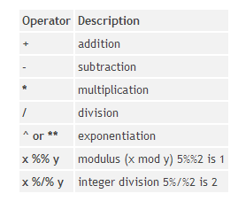
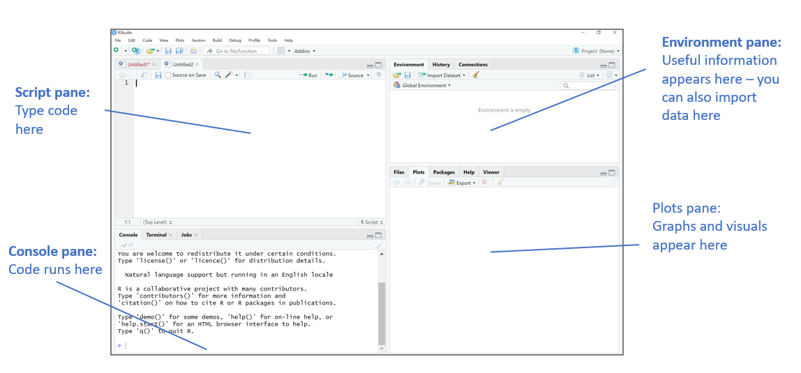

Come on, we all knew this was going to happen. We install RStudio through Anaconda, despite the ways in which that's not entirely ideal: of _course_ Coral is going to put class notes into Jupyter Notebooks (for as long as they have time to do so, anyway).

# Getting started in R

R was built by statisticians, not computer scientists. If we accept that about it, we'll all be happier. People who learned ~Python~ pretty much any other language first will find themselves making off-by-one errors pretty regularly. It's fine.

More usefully, here are facts about R from Professor Benis:
* R is a programming language
* R specializes in statistical computing and is excellent for mathematics, statistics, and analytics
* R is growing in popularity for research and business analytics
* R is a useful tool for any analyst and can help you understand the world around you!

Like Python, R is an **interpreted** language, not a compiled language. 

Comments are done the same way, though, with pound signs/hashtags. (And just like in Python and every other language, comments are expected, whenever you're doing something that isn't _super_ obvious to future-you or anyone else who might be reading your code.)


```R
# look at this sweet comment
```

We do assignment with ```<-``` which we can get (with the spaces around it!) by hitting ```Alt--``` (alt-minus / alt-dash).


```R
a_good_snake_case_object <- 42
print(a_good_snake_case_object)
```

    [1] 42
    

Secretly, yes, ```=``` will work just fine for this, too, but other R programmers will judge you. Try to build the habit of using  ```<-```, and I'll do the same.

You can just overwrite an object by assigning it again:


```R
a_good_snake_case_object <- 42
print(a_good_snake_case_object)
a_good_snake_case_object <- "potato"
print(a_good_snake_case_object)
```

    [1] 42
    [1] "potato"
    

**Some things to know about object names:**
* they cannot start with a digit, but digits can be included later
* they cannot have certain symbols in them (!, @, #, $, %, ^, -, &, *)
* they can&mdash;I kid you not&mdash;have periods in them 
    * BUT PLEASE DO NOT DO THIS (there are places where it makes sense, but we won't get to those places in a first-level R course)
* underscores: OK! useful, because **snake_case** is pretty standard in R coding, but you can't start with one
* they're case-sensitive (```Number``` is not the same as ```number```)

**Quick test for ourselves:**

Which of these object names will R accept? 

Which will other R programmers accept? ;)

* ```abc```
* ```iLoveBirds```
* ```99balloons```
* ```_thing3```
* ```hot.potato```
* ```my-favorite-number```
* ```coffee&tea```


```R
# let's actually test them!

# abc <- 5
# iLoveBirds <- 5
# 99balloons <- 5
# _thing3 <- 5
# hot.potato <- 5
# my-favorite-number <- 5
# coffee&tea <- 5
```

Objects can have any of the following **types** (the R function to find out the "type" is ```class(object)```, while ```typeof(object)``` finds out something slightly different, so perhaps I should call them "classes"):
* character - "y", "bird"
* numeric - 3, 12.3
* integer - 3L
* logical - TRUE/FALSE
* complex - 1 + 2i
* raw (we'll, uh, talk about this later)


```R
a <- 14.4
class(a)
typeof(a)
```


'numeric'


'double'


```R
animal <- "bird"
class(animal)
typeof(animal)
```


'character'


'character'


We'll talk in more detail about data types later, so don't stress about this overmuch yet! But also, don't get upset when R tries to enforce behaviors based on what type of thing you're dealing with. (For instance, it won't allow sneaky things like using ```+``` to concatenate strings.)

Anyway, R is for math! Let's do some math!

## Mathematical operators


(Thanks to [NCSU](https://it.chass.ncsu.edu/tutorials/r-project/section2.php) for the image!)

The order of operations is the same as we learned in algebra, but honestly? Use parentheses to group things. Parentheses are great. 


```R
"5 + 9"
5 + 9

"13 + 7"
13 + 7

"20 - 9"
20 - 9

"14 / 3"
14 / 3

"8 + 7 - 3 * 2"
8 + 7 - 3 * 2

"8 + (7 - 3) * 2"
8 + (7 - 3) * 2

"8 %% 3"
8 %% 3

"8 %/% 3"
8 %/% 3

"2 ^ 3"
2 ^ 3

"2 ** 3"
2 ** 3
```


'5 + 9'


14


'13 + 7'


20


'20 - 9'


11


'14 / 3'


4.66666666666667


'8 + 7 - 3 * 2'


9


'8 + (7 - 3) * 2'


16


'8 %% 3'


2


'8 %/% 3'


2


'2 ^ 3'


8


'2 ** 3'


8


It is, perhaps, unsurprising that we can also do math with objects:


```R
num1 <- 1
num2 <- 3
num3 <- 5

num1 + num2 + num3
num3 - num2
num3 / num2

```


9


2


1.66666666666667


Total side note, but I mentioned that you can't go around concatenating strings with plus signs. There is, actually, a thing for that:


```R
str1 <- "birds"
str2 <- "rock"

# fail
str1 + str2

# not a fail
paste(str1, str2)
```


    Error in str1 + str2: non-numeric argument to binary operator
    Traceback:
    


## Vectors

The first data structure we've met, so far, in our R journey (assuming we read the chapter ;)), is the vector. You can generate a vector that is a range of numbers from ```m``` through ```n``` **inclusive,** with the syntax ```m:n```


```R
my_vector <- 5:10
print(my_vector_vector)
```


```R
# what do we think this will give us?
my_vector[1]
```


```R
# and this?
typeof(my_vector)
```


```R
# and this? 
typeof(my_vector[1]/2)
```

Anyway, vectors are useful. Math on vectors is done element by element, by default. So if you have two vectors of equal length, whatever operation you run will happen between element 1 of the first vector and element 1 of the second vector, then move on to element 2 of both, and so on, leaving you with a result that is a vector of the same length.


```R
# c() is a function that concatenates things into a vector
a <- c(2, 2, 2, 2, 2)
b <- c(3, 3, 3, 3, 3)
a + b 
b - a
a * b
```

If one vector is shorter, it will be repeated in order to work with the longer vector. This is really obvious when you're running a scalar (which is like a single-element vector, right?) up against a vector:


```R
a * 2
```

But it works a little less obviously when you're combining two vectors of unequal length:


```R
x <- 1:12
y <- 1:3

x
y
x + y
```

SOMETIMES it will throw you a warning, but (as you saw above) not always:


```R
x <- 1:10
y <- 1:3
x + y
```

It's also worth pointing out, you can use c() to combine vectors:


```R
z <- c(x, y)
z
```

## Functions

The syntax of function declaration in R is as follows:
```R
function_name <- function(arg1, arg2 = default_value) {
    ...
    }
```

You can create functions with or without arguments. 
You can give the arguments default values or not. 
The function **does** have to have a name (also snake_case), and you **do** need the curly braces.

A function will not run until you call it.


```R
add_some_numbers <- function(num1, num2 = 1) {
    num1 + num2
}

# no output! we haven't called it yet!
```


```R
# now we will call it
add_some_numbers(num1 = 4, num2 = 5)

```


```R
# let's mess around a bit with the parameters, yes?
add_some_numbers(4, 5)
add_some_numbers(1)
add_some_numbers(4, num2 = 5)
add_some_numbers(num1 = 4)
add_some_numbers(num2 = 4)
```

We can use a function that comes with R as part of our own function, too. Remember ```sample()``` from the book? In case not, here's how we use it:


```R
die <- 1:6 # die is an object holding a vector of 1 2 3 4 5 6

sample(die, size = 1)
sample(die, size = 5) # what's weird about this?
```


```R
# ok, making it work like an actual die
sample(die, size = 5, replace= TRUE)
```


```R
# so, our own function that rolls a particular number of dice of a particular size:
dice_roller <- function(die_size = 6, number_of_rolls = 1) {
    the_die <- 1:die_size
    # we can use sample() inside our own function
    sample(the_die, size = number_of_rolls, replace = TRUE)
}

# roll a d6 one time
dice_roller()

# roll a d20 twice
dice_roller(die_size = 20, number_of_rolls = 2)
```


```R
# OK, and what if we want to deal with weighted dice? 
roll_weighted_d6 <- function(){
  die <- 1:6
  sample(die, 1, prob = c(1/8,1/8,1/8,1/8,1/8,3/8))
}

roll_weighted_d6()
roll_weighted_d6()
roll_weighted_d6()
roll_weighted_d6()
roll_weighted_d6()
roll_weighted_d6()
roll_weighted_d6()

```

Hmmm. Maybe we should run this more often and see what kind of statistics we get on it?


```R
# first let's look at unweighted dice
unweighted_rolls <- replicate(10000, dice_roller(6,1))

mean(unweighted_rolls)
median(unweighted_rolls)
hist(unweighted_rolls)

```


```R
# and weighted?

weighted_rolls <- replicate(10000, roll_weighted_d6())

mean(weighted_rolls)
median(weighted_rolls)
hist(weighted_rolls)
```


```R

```

## RStudio

RStudio is the integrated development environment we'll be using for R. (I'll make notebooks, when it makes sense. I won't expect you to make notebooks, though.)


(Big thanks to Jordan Benis for this image!)

You can get it with Anaconda, if you don't mind running a slightly older version of the software. I do this for a number of reasons, but mostly because I am not an administrator on my work machine, and I really like having access to notebooks. You will likely have an easier life if you get your RStudio elsewhere:
 * https://rstudio.com/products/rstudio/download/ OR
 * https://cran.r-project.org/


```R

```
