# R Packages

## Installation

If you need to add a package to R, the command is
```R
install.packages("package_name")
```

You can install multiple packages like so:
```R
install.packages(c("package_name1", "package_name2"))
```

### Some notes, though:
* You only have to do this once. 
* `install.packages()` installs the package to R, but doesn't activate it within your workspace. 
* It's something you do **from the console.** It's considered bad manners to add package installation to an .R script.

You can see what's installed with the command
```R
library()
```

The main repository for R packages is CRAN, The Comprehensive R Archive Network, at https://cran.r-project.org/. It has 16294 packages available (9/16/2020). 

There are other places to get R packages&mdash;we can write our own!&mdash;but CRAN is generally considered the most safe and reliable source. (R's like most programming languages: if you're going to download a library/package from a rando, make sure it's a rando you have reason to trust.)


```R
library()
```

## Loading packages for use

The command to load a package for use in your current session is
```R
library("package_name") # you can leave off the quotation marks if you want
```

This is fine to do in scripts. Necessary, even. Be cool and put all of your `library()` statements at the **top** of the script, so anyone who wants to try to run it can see what they're going to need to install easily. 

That said, R will let you know if you haven't loaded a library that you need:


```R
x <- c(1, 2, 2, 3, 4, 5, 5, 6)
qplot(x, binwidth = 1)
```


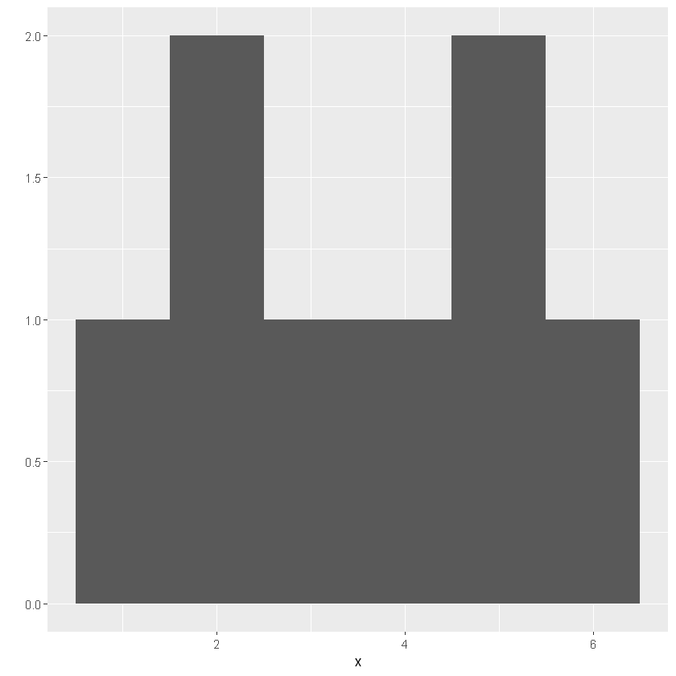


```R
library(ggplot2)
x <- c(1, 2, 2, 3, 4, 5, 5, 6)
qplot(x, binwidth = 1)
```


I went and brought up `qplot()`, so let's do this thing:


```R
# this is going to show a lot of code
qplot  
```


<pre class=language-r><code>function (x, y, ..., data, facets = NULL, margins = FALSE, geom = "auto", 
<span style=white-space:pre-wrap>    xlim = c(NA, NA), ylim = c(NA, NA), log = "", main = NULL, </span>
<span style=white-space:pre-wrap>    xlab = NULL, ylab = NULL, asp = NA, stat = NULL, position = NULL) </span>
{
<span style=white-space:pre-wrap>    caller_env &lt;- parent.frame()</span>
<span style=white-space:pre-wrap>    if (!missing(stat)) </span>
<span style=white-space:pre-wrap>        warning("`stat` is deprecated", call. = FALSE)</span>
<span style=white-space:pre-wrap>    if (!missing(position)) </span>
<span style=white-space:pre-wrap>        warning("`position` is deprecated", call. = FALSE)</span>
<span style=white-space:pre-wrap>    if (!is.character(geom)) </span>
<span style=white-space:pre-wrap>        stop("`geom` must be a character vector", call. = FALSE)</span>
<span style=white-space:pre-wrap>    exprs &lt;- rlang::enquos(x = x, y = y, ...)</span>
<span style=white-space:pre-wrap>    is_missing &lt;- vapply(exprs, rlang::quo_is_missing, logical(1))</span>
<span style=white-space:pre-wrap>    is_constant &lt;- (!names(exprs) %in% ggplot_global$all_aesthetics) | </span>
<span style=white-space:pre-wrap>        vapply(exprs, rlang::quo_is_call, logical(1), name = "I")</span>
<span style=white-space:pre-wrap>    mapping &lt;- new_aes(exprs[!is_missing &amp; !is_constant], env = parent.frame())</span>
<span style=white-space:pre-wrap>    consts &lt;- exprs[is_constant]</span>
<span style=white-space:pre-wrap>    aes_names &lt;- names(mapping)</span>
<span style=white-space:pre-wrap>    mapping &lt;- rename_aes(mapping)</span>
<span style=white-space:pre-wrap>    if (is.null(xlab)) {</span>
<span style=white-space:pre-wrap>        xlab &lt;- rlang::quo_name(exprs$x)</span>
<span style=white-space:pre-wrap>    }</span>
<span style=white-space:pre-wrap>    if (is.null(ylab)) {</span>
<span style=white-space:pre-wrap>        if (rlang::quo_is_null(exprs$y)) {</span>
<span style=white-space:pre-wrap>            ylab &lt;- "NULL"</span>
<span style=white-space:pre-wrap>        }</span>
<span style=white-space:pre-wrap>        else {</span>
<span style=white-space:pre-wrap>            ylab &lt;- rlang::quo_name(exprs$y)</span>
<span style=white-space:pre-wrap>        }</span>
<span style=white-space:pre-wrap>    }</span>
<span style=white-space:pre-wrap>    if (missing(data)) {</span>
<span style=white-space:pre-wrap>        data &lt;- data.frame()</span>
<span style=white-space:pre-wrap>        facetvars &lt;- all.vars(facets)</span>
<span style=white-space:pre-wrap>        facetvars &lt;- facetvars[facetvars != "."]</span>
<span style=white-space:pre-wrap>        names(facetvars) &lt;- facetvars</span>
<span style=white-space:pre-wrap>        facetsdf &lt;- as.data.frame(mget(facetvars, envir = caller_env))</span>
<span style=white-space:pre-wrap>        if (nrow(facetsdf)) </span>
<span style=white-space:pre-wrap>            data &lt;- facetsdf</span>
<span style=white-space:pre-wrap>    }</span>
<span style=white-space:pre-wrap>    if ("auto" %in% geom) {</span>
<span style=white-space:pre-wrap>        if ("sample" %in% aes_names) {</span>
<span style=white-space:pre-wrap>            geom[geom == "auto"] &lt;- "qq"</span>
<span style=white-space:pre-wrap>        }</span>
<span style=white-space:pre-wrap>        else if (missing(y)) {</span>
<span style=white-space:pre-wrap>            x &lt;- rlang::eval_tidy(mapping$x, data, caller_env)</span>
<span style=white-space:pre-wrap>            if (is.discrete(x)) {</span>
<span style=white-space:pre-wrap>                geom[geom == "auto"] &lt;- "bar"</span>
<span style=white-space:pre-wrap>            }</span>
<span style=white-space:pre-wrap>            else {</span>
<span style=white-space:pre-wrap>                geom[geom == "auto"] &lt;- "histogram"</span>
<span style=white-space:pre-wrap>            }</span>
<span style=white-space:pre-wrap>            if (is.null(ylab)) </span>
<span style=white-space:pre-wrap>                ylab &lt;- "count"</span>
<span style=white-space:pre-wrap>        }</span>
<span style=white-space:pre-wrap>        else {</span>
<span style=white-space:pre-wrap>            if (missing(x)) {</span>
<span style=white-space:pre-wrap>                mapping$x &lt;- rlang::quo(seq_along(!!mapping$y))</span>
<span style=white-space:pre-wrap>            }</span>
<span style=white-space:pre-wrap>            geom[geom == "auto"] &lt;- "point"</span>
<span style=white-space:pre-wrap>        }</span>
<span style=white-space:pre-wrap>    }</span>
<span style=white-space:pre-wrap>    p &lt;- ggplot(data, mapping, environment = caller_env)</span>
<span style=white-space:pre-wrap>    if (is.null(facets)) {</span>
<span style=white-space:pre-wrap>        p &lt;- p + facet_null()</span>
<span style=white-space:pre-wrap>    }</span>
<span style=white-space:pre-wrap>    else if (is.formula(facets) &amp;&amp; length(facets) == 2) {</span>
<span style=white-space:pre-wrap>        p &lt;- p + facet_wrap(facets)</span>
<span style=white-space:pre-wrap>    }</span>
<span style=white-space:pre-wrap>    else {</span>
<span style=white-space:pre-wrap>        p &lt;- p + facet_grid(facets = deparse(facets), margins = margins)</span>
<span style=white-space:pre-wrap>    }</span>
<span style=white-space:pre-wrap>    if (!is.null(main)) </span>
<span style=white-space:pre-wrap>        p &lt;- p + ggtitle(main)</span>
<span style=white-space:pre-wrap>    for (g in geom) {</span>
<span style=white-space:pre-wrap>        params &lt;- lapply(consts, rlang::eval_tidy)</span>
<span style=white-space:pre-wrap>        p &lt;- p + do.call(paste0("geom_", g), params)</span>
<span style=white-space:pre-wrap>    }</span>
<span style=white-space:pre-wrap>    logv &lt;- function(var) var %in% strsplit(log, "")[[1]]</span>
<span style=white-space:pre-wrap>    if (logv("x")) </span>
<span style=white-space:pre-wrap>        p &lt;- p + scale_x_log10()</span>
<span style=white-space:pre-wrap>    if (logv("y")) </span>
<span style=white-space:pre-wrap>        p &lt;- p + scale_y_log10()</span>
<span style=white-space:pre-wrap>    if (!is.na(asp)) </span>
<span style=white-space:pre-wrap>        p &lt;- p + theme(aspect.ratio = asp)</span>
<span style=white-space:pre-wrap>    if (!missing(xlab)) </span>
<span style=white-space:pre-wrap>        p &lt;- p + xlab(xlab)</span>
<span style=white-space:pre-wrap>    if (!missing(ylab)) </span>
<span style=white-space:pre-wrap>        p &lt;- p + ylab(ylab)</span>
<span style=white-space:pre-wrap>    if (!missing(xlim)) </span>
<span style=white-space:pre-wrap>        p &lt;- p + xlim(xlim)</span>
<span style=white-space:pre-wrap>    if (!missing(ylim)) </span>
<span style=white-space:pre-wrap>        p &lt;- p + ylim(ylim)</span>
<span style=white-space:pre-wrap>    p</span>
}</code></pre>


```R
# maybe more useful - pulls up the help file
?qplot
```

The only thing we've really learned about `qplot()` from the book is how we can make a histogram with it. So both the code and the help file are a little overwhelming, right this second. All of `ggplot2` is going to get easier over time. 

Let's make a quickplot from the `diamonds` dataset that comes built into R. We're going to need one piece the book didn't give us, which is that `diamonds` is a data frame, and we want one column (variable) out of it, to make a histogram out of. So we'll specify it with the optional `data =` parameter in `qplot()`:


```R
# carat is a continuous variable
qplot(carat, data = diamonds, binwidth = .25)
```


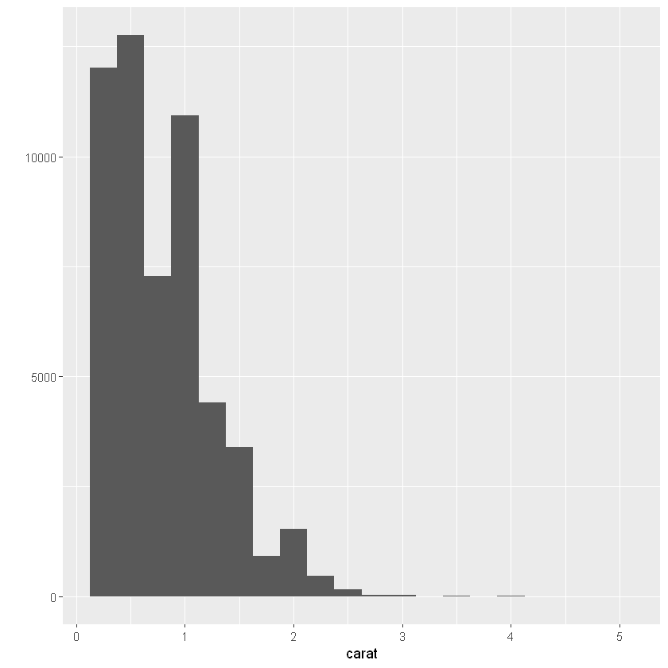


```R
# cut and clarity are categorical variables
# (this is actually a bar chart, not a histogram)
qplot(cut, data = diamonds)
```


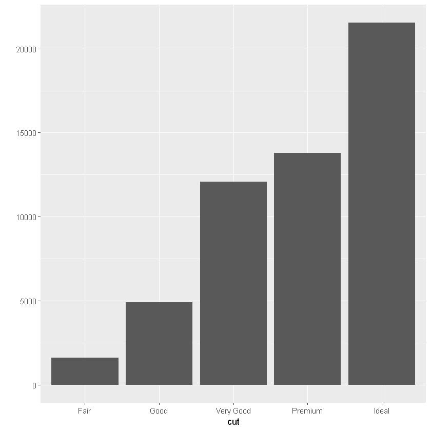


```R
# so here is a thing I did this week, for fun

# simulates rolling two 6-sided dice
two_d6 <- function() {
  die <- 1:6
  dice <- sample(die, size=2, replace=T)
  return(sum(dice)) # explicit returns in R are a thing and make me feel better
}

# simulates rolling two Sicherman dice
# https://en.wikipedia.org/wiki/Sicherman_dice
two_sicherman_dice <- function() {
  die1 <- c(1, 2, 2, 3, 3, 4)
  die2 <- c(1, 3, 4, 5, 6, 8)
  return(sample(die1, size=1) + sample(die2, size=1))
}

# simulates each thing 10k times
rolling_2d6_10k_times <- replicate(10000,two_d6())
rolling_2sich_10k_times <- replicate(10000,two_sicherman_dice())

# plots each histogram, for comparison
qplot(rolling_2d6_10k_times, binwidth=1)
qplot(rolling_2sich_10k_times, binwidth=1)

```


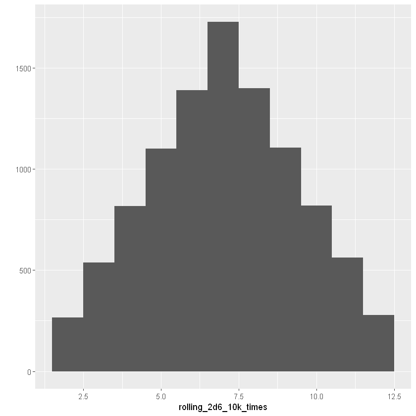


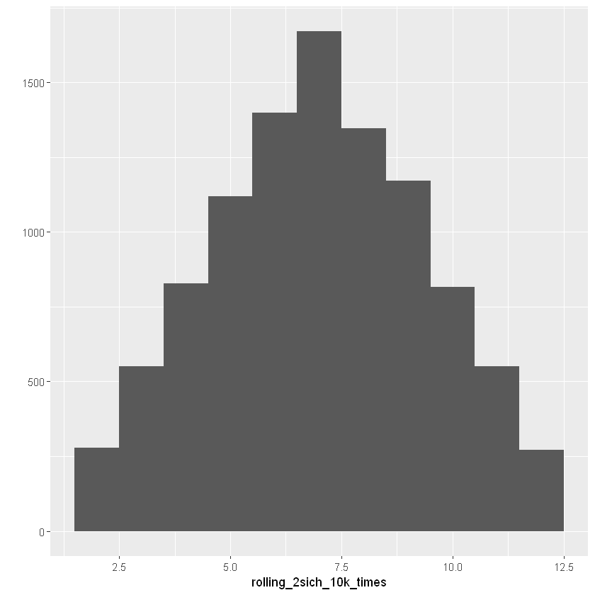


OK, I think we can all agree that histograms are great and useful, but sometimes we want something different, right? (Right.)

We're going to learn to make a few other graphs tonight, because that will help us explore data more quickly.

But first I need to do a thing. Because the diamonds dataset is too big.


```R
# I am just making a smaller, 100-row version of the diamonds data frame
# massive appreciation to Douglas Bates at UWisc for the idea
# http://pages.stat.wisc.edu/~st849-1/Rnotes/qplot.pdf
set.seed(1234) # Make the sample reproducible
dsmall <- diamonds[sample(nrow(diamonds), 100), ]
```

# `qplot()` parameters - a quick intro

qplot expects the following parameters, though you've probably noticed several of them are optional:
* x - the independent variable
* y - the dependent variable (optional! we haven't included this yet!)
* data - a data frame or tibble (also optional! it does its best if you don't provide this)
* geom - what kind of plot are we making? (it'll make its best guess if you don't specify)
* xlim - a two-element vector showing the start and end of the x axis (it'll guess if you don't specify)
* ylim - same, but the y axis (same)
* xlab - a label for the x axis, optional
* ylab - a label for the y axis, optional
* main - a label for the whole plot

```R
qplot(x, y=NULL, data, geom="auto", xlim = c(NA, NA), ylim =c(NA, NA))
```

If you **only specify x** and not y, it's going to assume you want a **histogram** or **bar chart,** depending on your data type:
```R
qplot(carat, data = diamonds, binwidth = .5)
qplot(cut, data = diamonds)
qplot(rolling_2d6_10k_times, binwidth=1)
```

If you **specify x _and_ y** and you don't tell it otherwise, it's going to assume you want a **scatterplot**:


```R
qplot(carat, price, data = dsmall)

# same, more fully specified, fine if it makes you more comfortable:
#qplot(x = carat, y = price, data = dsmall)
```


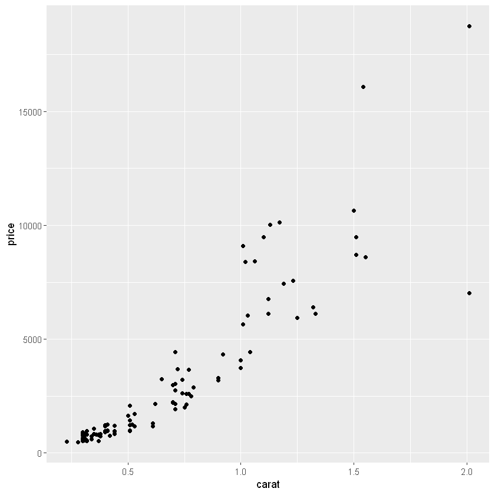


Nobody can stop you from specifying the geom, though. What if you want a boxplot?


```R
# boxplot!
qplot(cut, price, data = dsmall, geom = "boxplot")
```


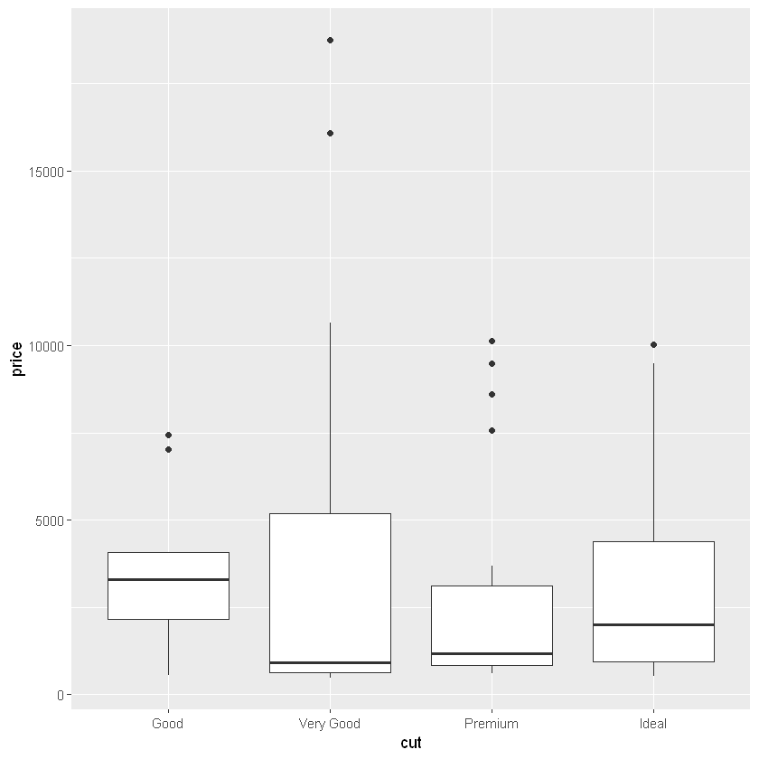


```R
# we can make it prettier by specifying a fill color for each one:
qplot(cut, price, data = dsmall, geom="boxplot", fill=cut)
```


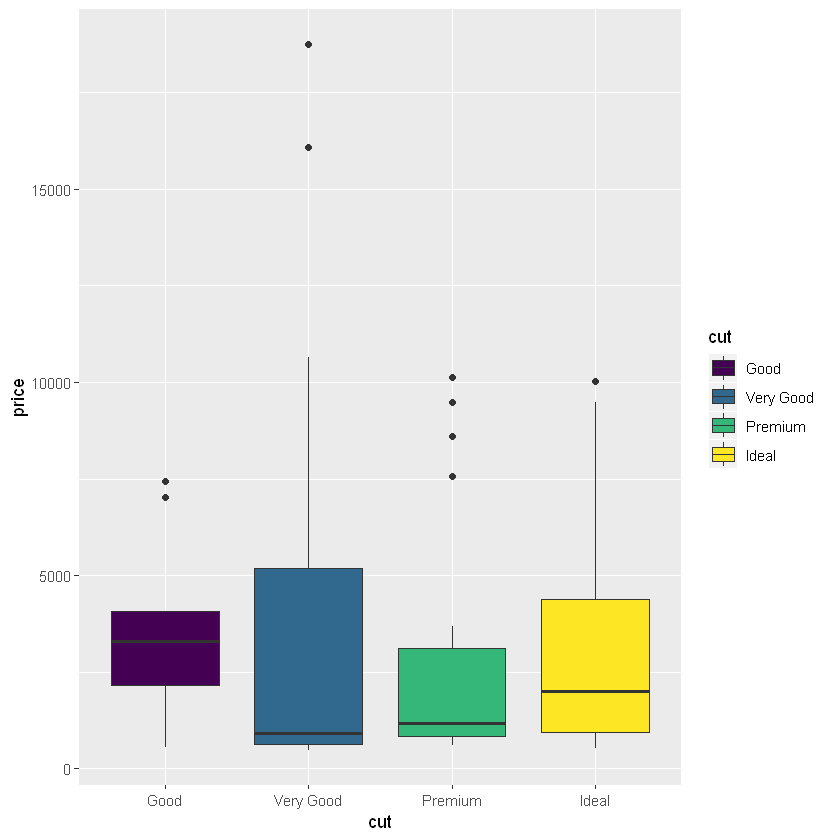


```R
# we can also break down our data with a fill 
qplot(carat, data = dsmall, binwidth=.25, fill=cut)
```


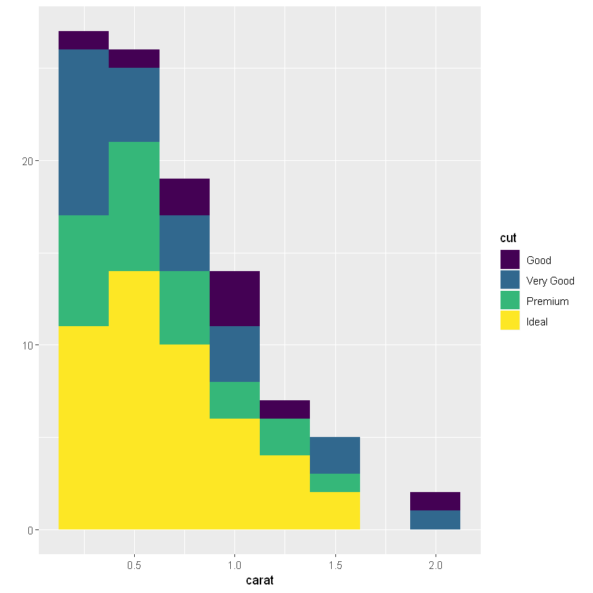


```R
# we can also break down our data with a fill 
# stacked bar chart!
qplot(color, data = dsmall, fill=cut)
```


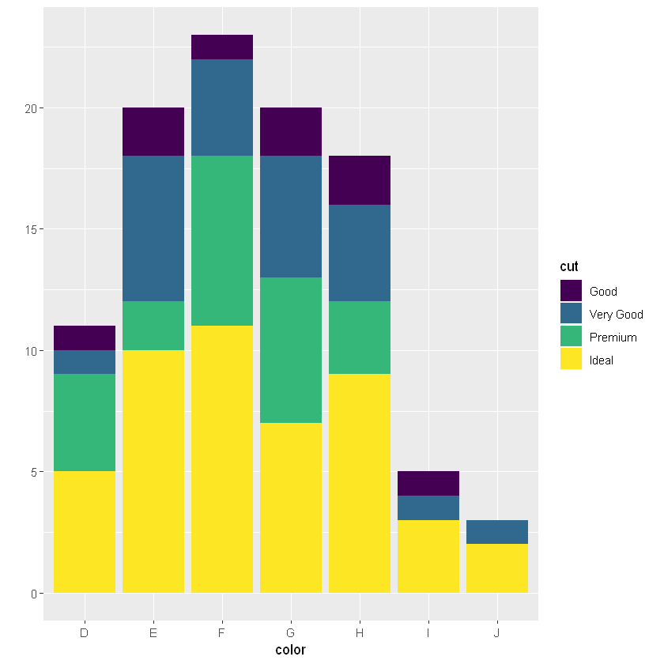


```R
# or with coloration
qplot(carat, price, data = dsmall, color = cut, xlab = "Carats", ylab = "Price", main = "Diamonds")
```


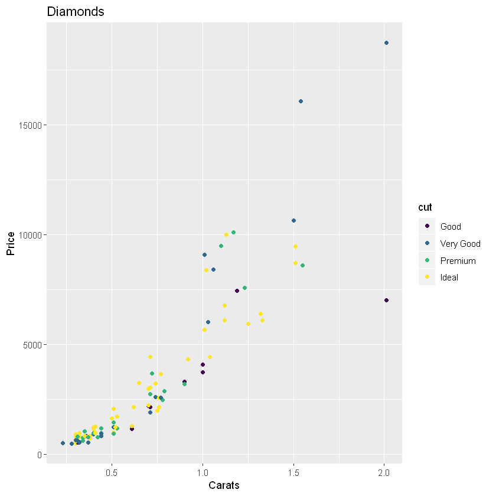


# Conditionals

OK, I really slipped up last week by not telling you about conditionals and then assigning a problem that kind of assumed you knew how conditionals worked. I'm sorry. I'll fix it now.

Here's the format:

```R
if (condition1) {
    # what happens if condition1 is true
} else if (condition2) {
    # what happens if condition1 is false and condition2 is true
} else {
    # what happens if both condition1 and condition2 are false
}
```

Comparison operators:
* `<` 	less than
* `<=` 	less than or equal to
* `>` 	greater than
* `>=` 	greater than or equal to
* `==` 	exactly equal to
* `!=` 	not equal to
* `!x` 	Not x
* `x | y` 	x OR y
* `x & y` 	x AND y

Given this, let's refactor my (honestly sort of messy) solution from last week's problem:


```R
# gotta define weird_dice() but this is not the one from the homework
weird_dice <- function() {
    d8 <- sample(1:8, size = 1)
    d12 <- sample(1:12, size = 1)
    return(d8 + d12)
}

# the original
weird_dice_rolled_3x <- function() {
  if (weird_dice() >= 13) {
    return(1)
  }
  if (weird_dice() >= 13) {
    return(1)
  }
  if (weird_dice() >= 13) {
    return(1)
  }
  # none of the first rolls is 
  return(0)
}

weird_dice_rolled_3x()
```


1


```R
# gotta define weird_dice() but this is not the one from the homework
weird_dice <- function() {
    d8 <- sample(1:8, size = 1)
    d12 <- sample(1:12, size = 1)
    return(d8 + d12)
}

# refactored, a little
weird_dice_rolled_3x <- function() {
  if (weird_dice() >= 13) {
    return(1)
  }
  else if (weird_dice() >= 13) {
    return(1)
  }
  else if (weird_dice() >= 13) {
    return(1)
  }
  else {
  return(0)
  }
}

weird_dice_rolled_3x()
```


1


I'm going to give it at least another week, maybe more, before I ask you to write any code with conditionals. I just wanted to make it so that you could finish last week's final problem if it was bothering you, you know?


```R

```
